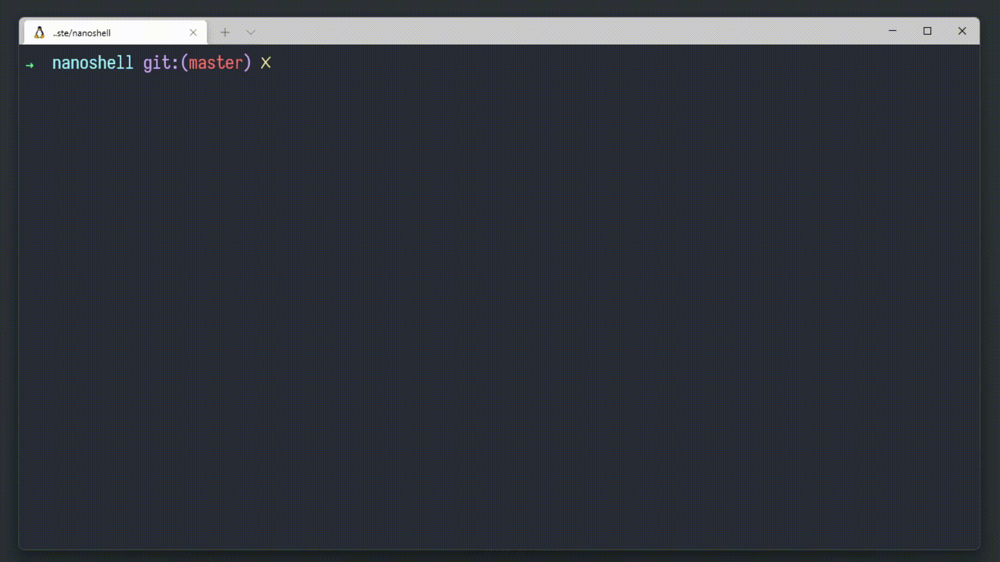

# Nanoshell
This project is part of the ["Making your own Linux Shell in C"](https://www.geeksforgeeks.org/making-linux-shell-c/) article by [geeks for geeks](https://www.geeksforgeeks.org/). A guide to implementing a [shell](https://www.geeksforgeeks.org/introduction-linux-shell-shell-scripting/) with basic functions, named by me to nanoshell.

### What is Nanoshell?
A [shell](https://en.wikipedia.org/wiki/Shell_(computing)) is a special user program that provides an interface for the user to use [operating system](https://en.wikipedia.org/wiki/Operating_system) services. Shell accepts human readable commands from the user and converts them into something the [kernel](https://en.wikipedia.org/wiki/Kernel_(operating_system)) can understand. It is a command language interpreter that executes reading commands from input devices such as keyboards or files. The [shell](https://en.wikipedia.org/wiki/Shell_(computing)) is started when the user logs in or starts the [terminal](https://en.wikipedia.org/wiki/Computer_terminal). This project is part of the ["Making your own Linux Shell in C"](https://www.geeksforgeeks.org/making-linux-shell-c/) article by [geeks for geeks](https://www.geeksforgeeks.org/). A guide to implementing a [shell](https://www.geeksforgeeks.org/introduction-linux-shell-shell-scripting/) with basic functions, named by me to nanoshell.

### Demo


## Getting started
**Follow the steps below**
```bash
# Clone the project and access the folder
git clone https://github.com/wwwwelton/nanoshell && cd nanoshell/

# Run make so you can build the program
make

# Run the program
./nanoshell

# Write any shell command like
echo "hello nanoshell"

# Quit the program
exit

# Clean output objects with
make fclean

# Well done!
```

## Updating

This project can be updated with new features in the future.

## 📝 License

This project is licensed under the GNU General Public License v3.0 - see the [LICENSE](license) file for details.

---

Made by Welton Leite 👋 [See my linkedin](https://www.linkedin.com/in/welton-leite-b3492985/)
